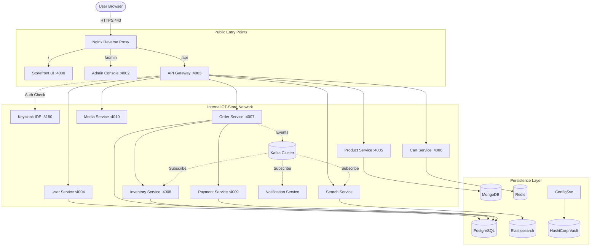
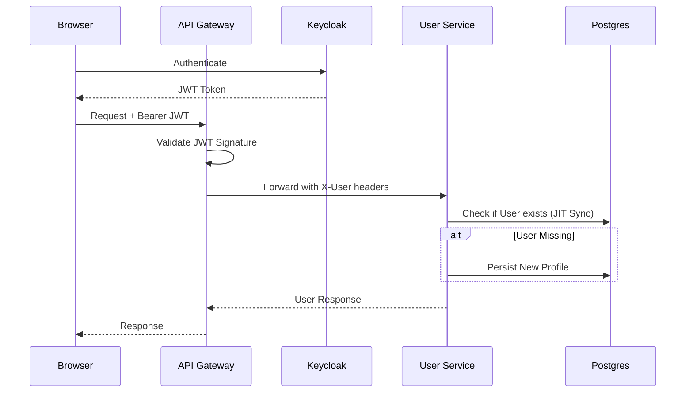
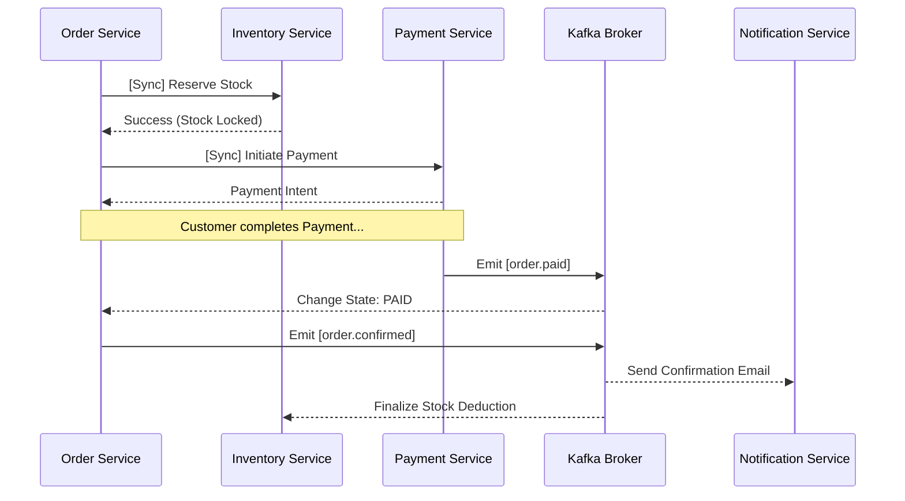

# GT Store: Enterprise Microservices E-Commerce Platform

GT Store is a high-performance, event-driven e-commerce ecosystem built on a resilient microservices architecture. It demonstrates modern enterprise patterns including API Gateway orchestration, Distributed Tracing, JIT Identity Synchronization, and multi-class persistence strategies.

---

## 🏗️ Technical Architecture

The platform follows a **decoupled microservices** pattern where each service owns its data and communicates through both synchronous (REST) and asynchronous (Kafka) channels.

### Network & Connectivity Diagram

The entry point is a production-hardened Nginx reverse proxy that handles SSL termination and intelligently routes traffic based on URL patterns.



---

## 📂 Database Structure & Relations

GT Store employs a **Database-per-Service** pattern to ensure independent scalability and schema autonomy. Relationships across services are maintained via **Logical IDs** and **Eventual Consistency**.

| Service | Database Type | Schema/Collection | Primary Responsibility |
| :--- | :--- | :--- | :--- |
| **User** | PostgreSQL | `users` | Profiles, Address Books, JIT Audit |
| **Product** | MongoDB | `products`, `categories` | Flexible Catalog, Variants, Banners |
| **Order** | PostgreSQL | `orders`, `order_items` | State Machine, Price Snapshots |
| **Inventory**| PostgreSQL | `stock`, `variants` | Real-time Reservation, SKUs |
| **Payment** | PostgreSQL | `transactions` | Gateway References (Razorpay/PayPal) |
| **Cart** | Redis | `cart:{id}` | High-speed ephemeral storage (TTL) |
| **Search** | Elasticsearch| `idx_products` | Full-text, Fuzzy searching |

### Cross-Service Relation Logic
- **`Order.userId`**: Resolves to `User.id` in PostgreSQL for profile/address lookup.
- **`OrderItem.productId`**: Resolves to `Product.id` in MongoDB.
- **`Inventory.variantId`**: Resolves to variant IDs embedded in Product documents.
- **`Transaction.orderId`**: Resolves to `Order.id` for financial reconciliation.

---

## 🔄 Major Flow Diagrams

### 1. Unified Authentication & JIT Sync
The platform trusts Keycloak for identity but maintains a local shadow profile for performance and audit.



### 2. Event-Driven Order Lifecycle
Managing stock, payments, and notifications asynchronously to ensure system responsiveness.



---

## ✨ Feature Matrix

### 🛒 Customer Experience
- **Dynamic Catalog**: Complex products with multi-variant support (size, color, etc.).
- **Smart Search**: Typo-tolerant search powered by Elasticsearch.
- **Persistent Cart**: Session-based carts that persist across logins.
- **Secure Checkout**: Integrated with **Razorpay** and **PayPal**.
- **Real-time Tracking**: Live order state updates from warehouse to delivery.

### 🛡️ Admin & Operations
- **Full Control**: CRUD operations for products, categories, and banners.
- **Inventory Control**: Real-time stock adjusting and low-stock indicators.
- **Order Management**: Transition orders through the fulfillment pipeline.
- **Observability**: Centralized logs (Loki) and metrics (Prometheus).

---

## 🛠️ Technology Stack

| Category | technologies |
| :--- | :--- |
| **Core** | Java 17, Spring Boot 3, Spring Cloud Gateway |
| **Frontend** | React 18, Vite, Tailwind CSS, TypeScript |
| **Messaging** | Apache Kafka, Zookeeper |
| **Persistence** | PostgreSQL 15, MongoDB 6, Redis 7, Elasticsearch 8 |
| **Identity & Secrets** | Keycloak (IAM), HashiCorp Vault (AppRole) |
| **Observability** | Prometheus, Grafana, Loki, Promtail, Zipkin |
| **Infrastructure** | Docker Compose, Nginx (SSL termination), Spring Cloud Config |

---

## 🚀 Getting Started

### Prerequisites
- Docker & Docker Compose
- 8GB+ System RAM (Recommended)

### Execution
```bash
# 1. Start all services (may take several minutes initially)
docker compose up -d --build

# 2. Access the Platform
# - Storefront: https://localhost (Trust self-signed cert)
# - Admin:     https://localhost/admin
# - Gateway:   https://localhost/api
```

### 🔐 Security & Secrets
The platform uses **HashiCorp Vault** for sensitive credential management. 
1. Ensure your root `.env` file contains the required AppRole credentials:
   ```env
   VAULT_ROLE_ID=your-role-id
   VAULT_SECRET_ID=your-secret-id
   ```
2. The Config Server automatically merges secrets from Vault into the application properties using a **Composite Backend** (Filesystem + Vault).

---

## 📊 Observability Dashboard

| Tool | URL | Credentials |
| :--- | :--- | :--- |
| **Grafana** | `http://localhost:4013` | `admin` / `admin` |
| **Prometheus** | `http://localhost:9090` | N/A |
| **Zipkin** | `http://localhost:4012` | N/A |
| **Loki** | `http://localhost:3100` | N/A |

---

## 🧪 Credentials for Testing
- **Customer**: `user1@example.com` / `password`
- **Administrator**: `admin1@example.com` / `password`
- **Platform Admin**: `admin` / `admin` (Keycloak/Grafana)