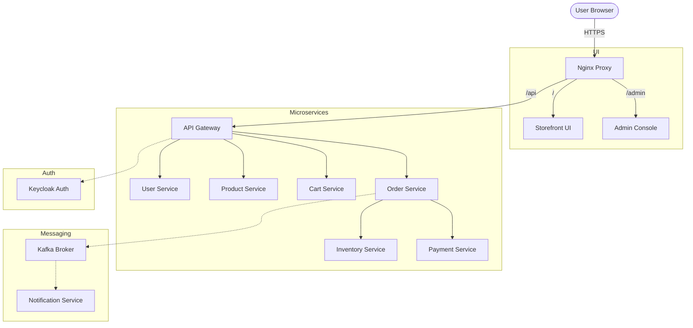

# GT Store: Microservices E-Commerce Platform

GT Store is a full-stack, distributed e-commerce platform designed with a high-performance, event-driven microservices architecture. It demonstrates modern enterprise patterns including API Gateway orchestration, Role-Based Access Control (RBAC), distributed tracing, and specialized database selection.

## 🚀 Quick Start

Ensure you have **Docker Desktop** running, then execute the following from the root directory:

```bash
docker compose up -d --build
```

### Access URLs
| Component | URL | Credentials |
| :--- | :--- | :--- |
| **Storefront** | [https://localhost](https://localhost) | `user1@example.com` / `password` |
| **Admin Console** | [https://localhost/admin](https://localhost/admin) | `admin1@example.com` / `password` |
| **Keycloak Admin** | [http://localhost:8180](http://localhost:8180) | `admin` / `admin` |
| **Grafana** | [http://localhost:3001](http://localhost:3001) | `admin` / `admin` |
| **Zipkin** | [http://localhost:9411](http://localhost:9411) | N/A |

> [!NOTE]
> The platform uses a self-signed SSL certificate for `localhost`. You may need to "Accept the Risk" in your browser initially.

---

## 🏗️ System Architecture

The platform is fronted by an Nginx reverse proxy that handles SSL termination and routes traffic to the appropriate microservice or frontend.



---

## 🛠️ Technology Stack

- **Backend**: Java 17, Spring Boot 3, Spring Cloud Gateway, Reactive Security.
- **Frontend**: React, TypeScript, Vite, Tailwind CSS.
- **Identity**: Keycloak (OAuth2 / OpenID Connect).
- **Messaging**: Apache Kafka.
- **Data Persistence**:
    - **PostgreSQL**: Relational data (Orders, Users, Payments, Inventory).
    - **MongoDB**: Flexible product catalog.
    - **Redis**: High-speed user carts.
- **Observability**: Prometheus, Grafana, Micrometer, Zipkin.
- **Infrastructure**: Docker Compose, Nginx (SSL/TLS).

---

## 📖 Evolution Roadmap

The project was developed in three distinct phases:

### [Phase 1: MVP Foundation](file:///d:/project%20slpro/gt-store/phase1.md)
Established the core architecture: API Gateway, User Service, Product Catalog with MongoDB, and the React Storefront.

### [Phase 2: Event-Driven Checkout](file:///d:/project%20slpro/gt-store/phase2.md)
Implemented the complex asynchronous checkout flow using Kafka, integrating Inventory reservation, Payment processing, and Email notifications.

### [Phase 3: Production Readiness & Admin](file:///d:/project%20slpro/gt-store/phase3.md)
Added Nginx reverse proxy with SSL, Role-Based Access Control (RBAC), more deep observability (metrics & tracing), and the Administrator Management UI.

---

## 🧪 Admin/Test Credentials

- **Standard User**: `user1@example.com` / `password`
- **Administrator**: `admin1@example.com` / `password`