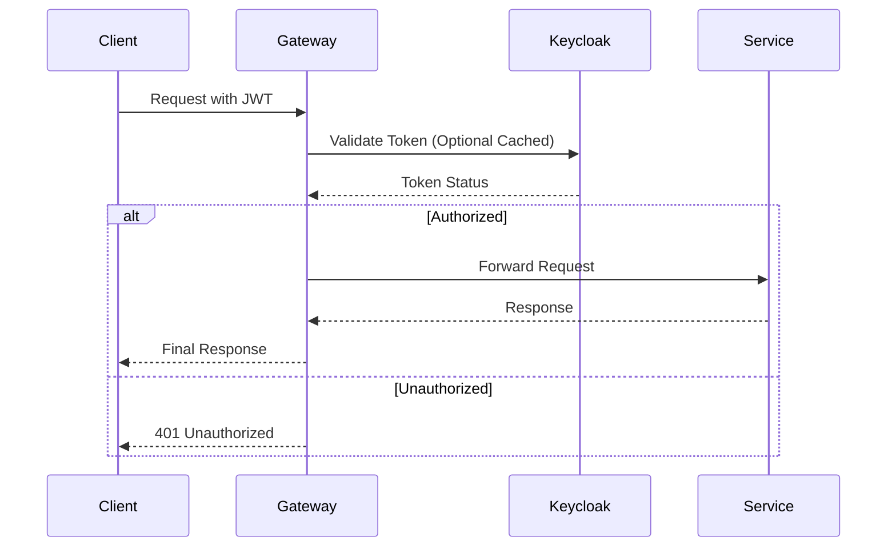

# API Gateway Service

The **API Gateway** is the single entry point for all GT Store microservices. It handles request routing, authentication verification (OAuth2), and aggregates API documentation (Swagger) from all downstream services.

## 🛠️ Technical Design

- **Framework**: Spring Boot 3 with Spring Cloud Gateway.
- **Security**: Reactive OAuth2 Resource Server integration with Keycloak.
- **Observability**: Distributed tracing via Zipkin and metrics via Prometheus/Grafana.
- **Resilience**: Configured with a default Retry filter for idempotent GET requests.

## ⚙️ Configurational Design

### Routes Mapping
The gateway routes traffic based on URL predicates:
- `/api/users/**` -> `user-service`
- `/api/products/**` -> `product-service`
- `/api/cart/**` -> `cart-service`
- `/api/orders/**` -> `order-service`
- `/api/inventory/**` -> `inventory-service`
- `/api/payments/**` -> `payment-service`
- `/api/search/**` -> `search-service`
- `/api/media/**` -> `media-service`

### Environment Variables
| Variable | Description | Default |
| :--- | :--- | :--- |
| `SERVER_PORT` | Service port | `4003` |
| `SPRING_SECURITY_OAUTH2_RESOURCESERVER_JWT_ISSUER_URI` | Keycloak realm issuer | `https://pahchaan.slpro.in/...` |
| `SPRING_CLOUD_GATEWAY_RETRY_RETRIES` | Number of retries for GET | `3` |

## 🔄 Interaction Flow

## 📖 Use Cases

- **Service Abstraction**: Clients only need to know one base URL (`https://gts-api.slpro.in`).
- **Unified Security**: Centralized JWT validation prevents downstream services from needing complex auth logic.
- **CORS Management**: Handles cross-origin resource sharing for both the Web and Admin frontends.
- **Documentation Hub**: Serves the shared Swagger UI for the entire platform at `/swagger-ui.html`.
