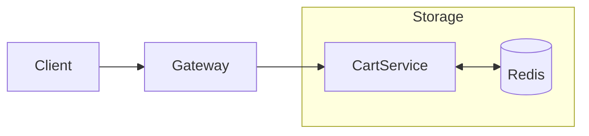

# Cart Service

The **Cart Service** manages temporary shopping cart data for both authenticated and session-based users. It is designed for high-speed read/write access using Redis.

## 🛠️ Technical Design

- **Framework**: Spring Boot 3 with Spring Data Redis.
- **Persistence**: **Redis** (In-memory store for high performance and expiration support).
- **Communication**: Synchronous REST APIs via the API Gateway.

## ⚙️ Configurational Design

### Environment Variables
| Variable | Description | Default |
| :--- | :--- | :--- |
| `SERVER_PORT` | Service port | `4006` |
| `SPRING_DATA_REDIS_HOST` | Redis host address | `host.docker.internal` |
| `SPRING_DATA_REDIS_PORT` | Redis port | `6379` |
| `REDIS_PASSWORD` | Redis authentication password | `khojo_redis_password` |

## 🔄 Interaction Flow

## ✨ Key Features

- **Anonymous Carts**: Supports cart persistence via session IDs for non-logged-in users.
- **Auto-Cleanup**: Leverages Redis TTL (Time-To-Live) to automatically purge abandoned carts.
- **Snapshot Storage**: Stores a JSON snapshot of product details to minimize cross-service joins during cart viewing.

## 📖 Use Cases

- **Cart Management**: Add, update, or remove items from the bag.
- **Total Calculation**: Provides real-time cart total reflecting current product prices.
- **Checkout Preparation**: Serves the initial item list when an order is being initiated.
