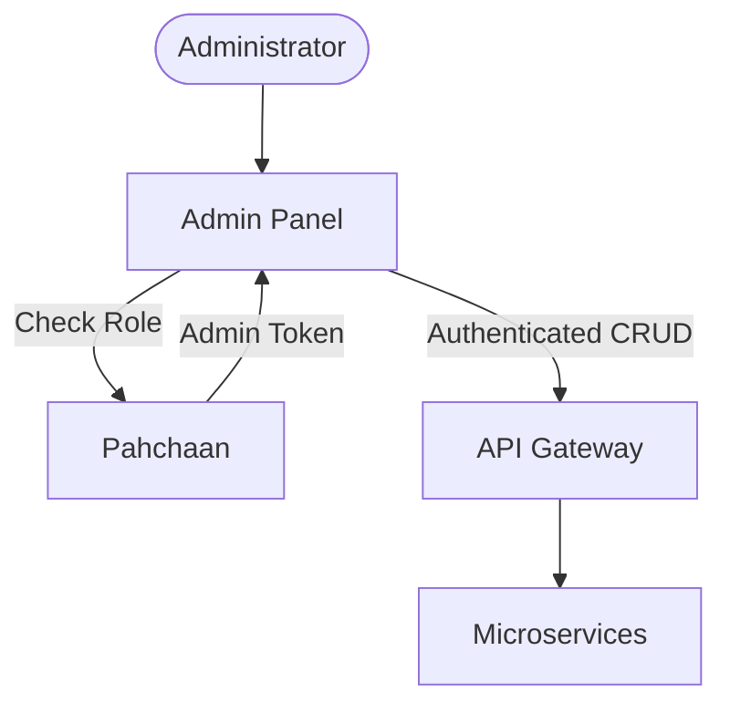

# GT Store Admin Panel

The **GT Store Admin Panel** is the command center for platform administrators. and it provides comprehensive tools for managing the catalog, monitoring orders, and controlling the visual appearance of the storefront.

## 🛠️ Technical Design

- **Framework**: **React 19** with **Vite**.
- **Styling**: **Tailwind CSS 4.0**.
- **State Management**: **TanStack Query** (v5) for high-performance data fetching.
- **Authentication**: **Keycloak (Pahchaan)** integration with role-based protection (Requires `GTS_ADMIN` role).
- **Icons**: Lucide React for consistent iconography.

## ⚙️ Configurational Design

### Access Control
- Access is restricted to users with the `GTS_ADMIN` role in Keycloak.
- The UI dynamically hides or shows management modules based on verified permissions.

### Environment Variables
| Variable | Description |
| :--- | :--- |
| `VITE_API_URL` | Base URL for the API Gateway |
| `VITE_KEYCLOAK_URL` | URL of the Identity Provider (Pahchaan) |
| `VITE_KEYCLOAK_REALM` | Keycloak realm name |
| `VITE_KEYCLOAK_CLIENT_ID` | OAuth2 Client ID for Admin |

## 🔄 Interaction Flow

## ✨ Key Features

- **Catalog Management**: Add, edit, or remove products and maintain the stock levels of variants.
- **Order Oversight**: Visual dashboard to monitor order flows, update shipping statuses, and manage cancellations.
- **Media Hub**: Centralized upload manager for product images and marketing banners.
- **User Insights**: (Future) Capability to manage user tiers and support requests.
- **Promotion Control**: Update homepage banners and featured categories in real-time.

## 📖 Use Cases

- **Inventory Updates**: Keeping stock numbers accurate across all SKUs.
- **Logistics Processing**: Transitioning orders from `AWAITING_FULFILLMENT` to `SHIPPED`.
- **Global Search Refresh**: Managing products, which triggers automatic re-indexing in Elasticsearch.
