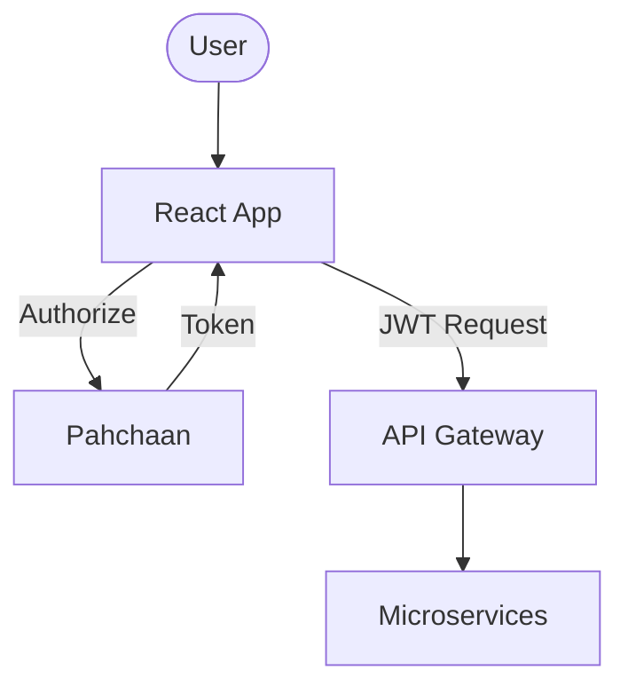

# GT Store Web (Storefront)

The **GT Store Web** is the primary customer-facing application. and built with a modern, high-performance tech stack, it provides a seamless shopping experience from product discovery to secure checkout.

## 🛠️ Technical Design

- **Framework**: **React** with **Next.js/Vite** (Vite-based SPA architecture).
- **Styling**: **Tailwind CSS 4.0** (Atomic CSS for fast, consistent UI development).
- **State Management**: **TanStack Query** (React Query) for server-state synchronization.
- **Authentication**: **Keycloak (Pahchaan)** integration via `@react-keycloak/web`.
- **UI Components**: Radix UI primitives and Lucide icons for accessible, premium-feel components.

## ⚙️ Configurational Design

### Environment Variables
| Variable | Description |
| :--- | :--- |
| `VITE_API_URL` | Base URL for the API Gateway |
| `VITE_KEYCLOAK_URL` | URL of the Identity Provider (Pahchaan) |
| `VITE_KEYCLOAK_REALM` | Keycloak realm name |
| `VITE_KEYCLOAK_CLIENT_ID` | OAuth2 Client ID |

## 🔄 Interaction Flow

## ✨ Key Features

- **Responsive Design**: Mobile-first architecture that scales beautifully to desktop.
- **Real-time Search**: Deduplicated search queries using custom hooks.
- **Secure Checkout**: Integrated with Razorpay and PayPal payment gateways.
- **Profile Management**: Dedicated account dashboard for order tracking and address management.
- **Performance**: Optimized asset loading and skeleton loaders for a smooth "app-like" feel.

## 📖 Use Cases

- **Shopping Journey**: Browsing categories, searching products, and adding to cart.
- **Account Management**: Updating personal details and tracking shipment status.
- **Checkout**: Safely placing orders using COD or Online Payment methods.
