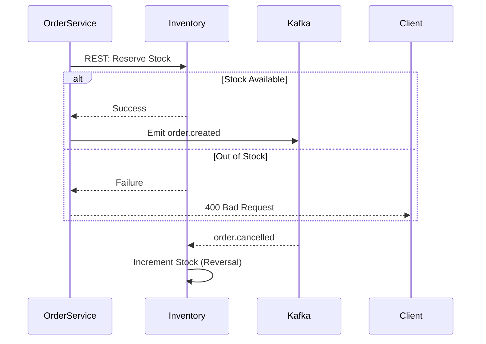

# Inventory Service

The **Inventory Service** is responsible for managing product stock levels across all variants. it ensures data consistency during high-concurrency order placement by handling stock reservations and reversals.

## 🛠️ Technical Design

- **Framework**: Spring Boot 3 with Spring Data JPA.
- **Persistence**: **PostgreSQL** (ACID compliant for transaction integrity).
- **Messaging**: Kafka Consumer for order lifecycle events.
- **API**: REST endpoints for stock checks and administrative updates.

## ⚙️ Configurational Design

### Kafka Topics
- `order.created`: Triggers stock reservation.
- `order.cancelled`: Triggers stock reversal.
- `order.failed`: Triggers stock reversal if reservation happened.

### Environment Variables
| Variable | Description | Default |
| :--- | :--- | :--- |
| `SERVER_PORT` | Service port | `4008` |
| `SPRING_DATASOURCE_URL` | PostgreSQL connection string | `jdbc:postgresql://postgres...` |
| `SPRING_KAFKA_BOOTSTRAP_SERVERS` | Kafka broker address | `kafka:29092` |

## 🔄 Interaction Flow

## ✨ Key Features

- **Stock Reservation**: Locks inventory items temporarily when an order is placed to prevent overselling.
- **Variant Tracking**: Manages stock at the granular SKU/Variant level.
- **Low Stock Alerts**: (Future) Capability to notify admins when stock falls below thresholds.

## 📖 Use Cases

- **Checkout Validation**: Checks if items in the cart are still available.
- **Stock replenishment**: Admin updates to add new inventory.
- **Automatic Recovery**: Reverts stock if a payment fails or a customer cancels an order.
