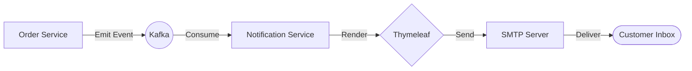

# Notification Service

The **Notification Service** handles all outbound communications for the GT Store platform. It is an event-driven service that listens to order lifecycle events and dispatches themed HTML emails based on predefined templates.

## 🛠️ Technical Design

- **Framework**: Spring Boot 3.
- **Protocol**: **SMTP** (Amazon SES, Gmail, or any standard SMTP server).
- **Template Engine**: **Thymeleaf** (Handles rich, responsive HTML email rendering).
- **Messaging**: Kafka Consumer for order lifecycle topics.

## ⚙️ Configurational Design

### Kafka Topics Subscribed
- `order.created`: Initial confirmation (Online vs COD).
- `order.paid`: Payment success notification.
- `order.shipped`: Dispatch notification with tracking context.
- `order.cancelled`: Cancellation and refund update.
- `order.failed`: Fulfillment or processing issue update.

### Environment Variables
| Variable | Description | Default |
| :--- | :--- | :--- |
| `SPRING_MAIL_HOST` | SMTP server host | `smtp.gmail.com` (Example) |
| `SPRING_MAIL_PORT` | SMTP server port | `587` |
| `SMTP_FROM` | Sender email address | `noreply@slpro.in` |
| `NOTIFICATION_CC` | CC address for all store alerts | `support@slpro.in` |

## 🔄 Interaction Flow

## ✨ Key Features

- **Themed Templates**: Fully customized HTML templates matching the GT Store brand.
- **Branding Logic**: Dynamically switches content based on payment method (e.g., specific instructions for COD).
- **Redundancy Protection**: Ensures customers only receive relevant updates (preventing duplicate emails for COD).

## 📖 Use Cases

- **Order Confirmation**: Sends a summary of items and shipping details immediately after purchase.
- **Payment Verification**: Notifies users when their online transaction is successfully settled.
- **Shipping Tracker**: Sends an email when the order is picked up by the courier.
- **Error Transparency**: Informs users immediately if an order cannot be fulfilled.
