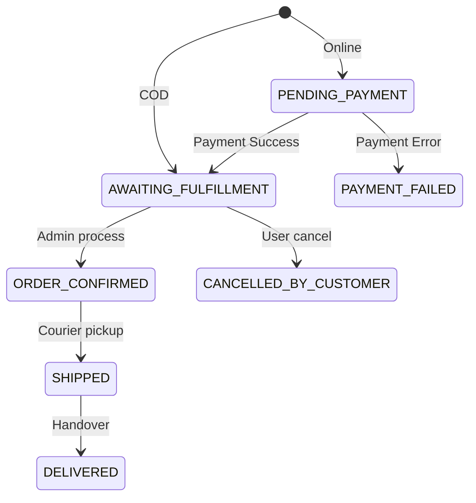

# Order Service

The **Order Service** is the central orchestrator of the GT Store platform. It manages the entire lifecycle of an order from creation to delivery using a robust state machine and asynchronous event propagation.

## 🛠️ Technical Design

- **Framework**: Spring Boot 3 with Spring Data JPA.
- **Persistence**: **PostgreSQL** (ACID storage for orders and snapshots).
- **Messaging**: Kafka Producer for broadcasting state changes.
- **State Machine**: Custom implementation managing transitions (Pending -> Paid -> Processing -> Shipped -> Delivered).

## ⚙️ Configurational Design

### Order Lifecycle States
- `PENDING_PAYMENT`: Awaiting online payment confirmation.
- `AWAITING_FULFILLMENT`: Initial state for COD or after payment for Online.
- `ORDER_CONFIRMED`: Admin has processed the order.
- `SHIPPED`: Order is with the courier.
- `DELIVERED`: Final successful state.
- `CANCELLED_BY_CUSTOMER`: User requested cancellation (restricted to pre-shipping).
- `FULFILLMENT_FAILED`: System error during processing (triggers refund).

### Environment Variables
| Variable | Description | Default |
| :--- | :--- | :--- |
| `SERVER_PORT` | Service port | `4007` |
| `INVENTORY_SERVICE_URL` | Inventory endpoint for reservation | `http://inventory-service...` |
| `PAYMENT_SERVICE_URL` | Payment endpoint for initiation | `http://payment-service...` |

## 🔄 Interaction Flow

## ✨ Key Features

- **Snapshot Architecture**: Stores shipping addresses and product prices at the time of purchase to protect against future changes.
- **Transactional Consistency**: Coordinates between Inventory and Payment services during order initiation.
- **Granular Events**: Publishes specific topics (`order.shipped`, `order.cancelled`) to allow decoupled reactions from other services.

## 📖 Use Cases

- **Order Placement**: Validates inventory and initiates the payment wall.
- **Order Tracking**: Allows customers to view their purchase history and current status.
- **Order Management**: Admin interface for updating statuses and managing logistics.
