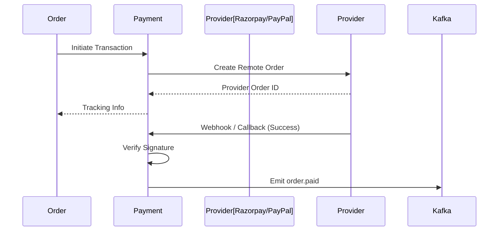

# Payment Service

The **Payment Service** acts as the secure gateway between GT Store and third-party financial providers. It handles transaction initiation, status callbacks, and automated refund processing.

## 🛠️ Technical Design

- **Framework**: Spring Boot 3.
- **Persistence**: **PostgreSQL** (Transaction logs and reference mapping).
- **Integrations**: 
  - **Razorpay**: Domestic and international cards, UPI, and Netbanking.
  - **PayPal**: Global payments and smart checkout.
- **Messaging**: Kafka Producer for `order.paid` events and Consumer for refund triggers.

## ⚙️ Configurational Design

### Supported Gateways
- `RAZORPAY`: Uses `razorpay_order_id` and secret verification.
- `PAYPAL`: Uses REST API for order capturing and execution.

### Environment Variables
| Variable | Description | Default |
| :--- | :--- | :--- |
| `RAZORPAY_KEY_ID` | Razorpay Public Key | `${SECRET}` |
| `RAZORPAY_KEY_SECRET` | Razorpay Secret Key | `${SECRET}` |
| `PAYPAL_CLIENT_ID` | PayPal Public Client ID | `${SECRET}` |
| `PAYPAL_CLIENT_SECRET` | PayPal Secret | `${SECRET}` |

## 🔄 Interaction Flow

## ✨ Key Features

- **Multi-Gateway Support**: Dynamically routes requests to Razorpay or PayPal based on user preference.
- **Automated Refunds**: Listens to `order.cancelled` or `fulfillment_failed` and triggers provider-level refunds automatically.
- **Idempotent Webhooks**: Ensures that duplicate callback notifications from providers don't cause duplicate processing.

## 📖 Use Cases

- **Checkout Payment**: Provides the secure bridge to complete a purchase.
- **Refund Management**: Handles the financial reversal when an order is cancelled.
- **Transaction Auditing**: Maintains a complete log of all successful and failed payment attempts.
