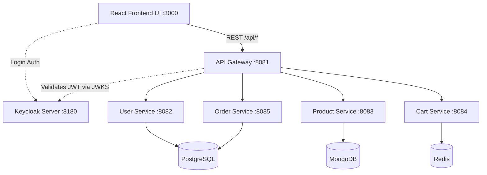

# GT Store: Phase 1 (MVP) Walkthrough

Congratulations! The foundational phase of the GT Store microservices platform is now fully implemented step by step according to the README plan. Here is a summary of what has been built.

## Infrastructure
All backing infrastructure runs centrally via Docker Compose on an isolated network.
- **Keycloak** (Mapped to `:8180` locally instead of 8080 to prevent conflicts): Handles authentication.
- **PostgreSQL**: Stores relational user profiles, addresses, and orders.
- **MongoDB**: Used by the product catalog to store documents for flexible categories and attributes.
- **Redis**: Caches ephemeral user carts keyed by the user's email ID.
- **Kafka / Zookeeper**: Standby infrastructure ready for async events in Phase 2.
- **Mailhog**: Up and running for local SMTP testing in the future.

## Microservices Architecture

### 1. API Gateway
Intercepts all `/api/*` requests and validates OAuth2 Keycloak JWTs. It parses the claims using a custom global filter and propagates `X-User-Email` and `X-User-Name` as internal system headers for downstream services.

### 2. User Service
Upserts the user profile into PostgreSQL upon their first authenticated request via the `/me` endpoint. Manages multi-address profiles linked natively inside SQL.

### 3. Product Service
A Catalog module built on Spring Data MongoDB. Products feature robust metadata arrays and utilize a native Text Index to afford regex/keyword searching.

### 4. Cart Service
Fully ephemeral shopping cart leveraging Redis Hash TTL storage. It natively groups duplicate items by `productId` to update quantities incrementally.

### 5. Order Service
Responsible for the synchronous MVP checkout flow (converting an active user cart into a PENDING order with calculated line items), establishing the entity records in PostgreSQL.

## Getting Started

Now that Docker is building the containers seamlessly:
1. Ensure the background `docker compose up -d --build` command finishes.
2. Open your browser and navigate to **[http://localhost:3000](http://localhost:3000)** to view the GT Store!
3. Click **Login** to authorize against Keycloak (use the included `gt-store-realm.json` test user params if prompted), and test out the mock shopping features.
