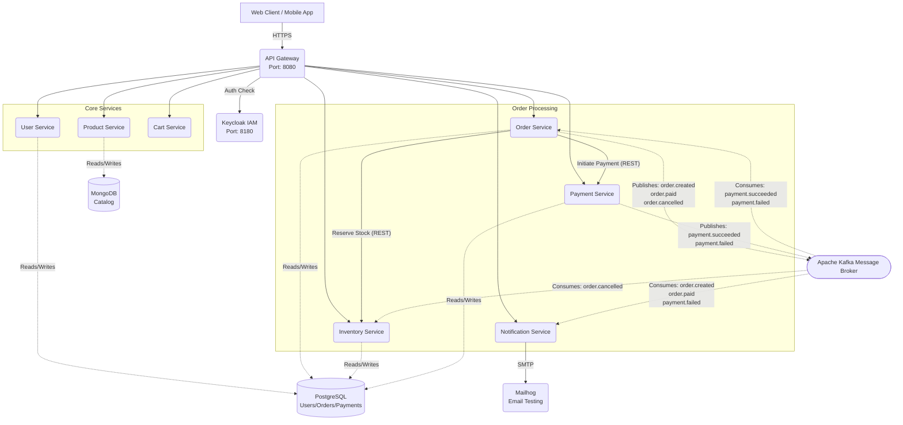
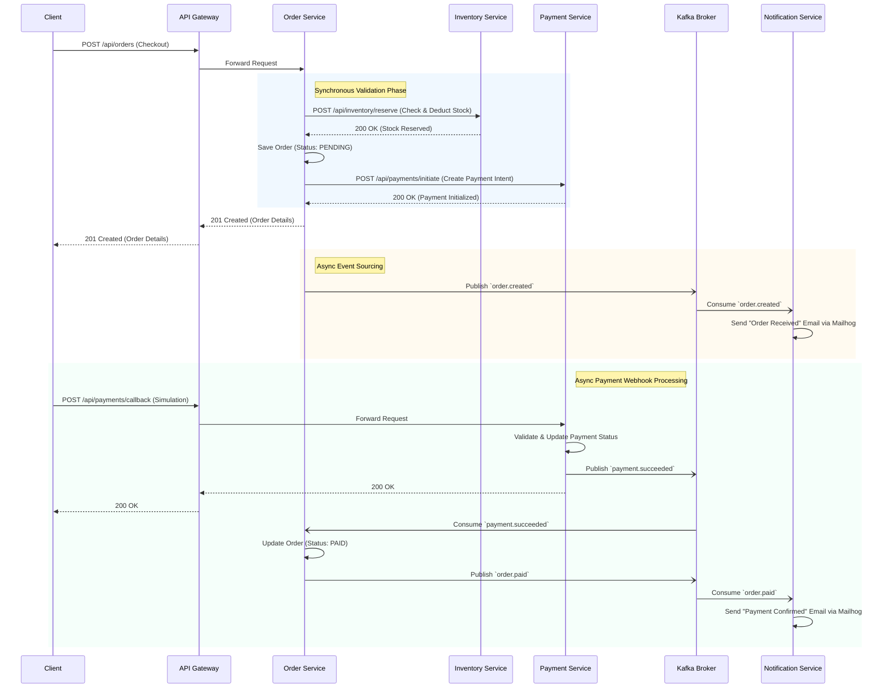

# GT Store - Phase 2 Documentation

Phase 2 of the GT Store project introduces a robust, event-driven microservices architecture. Moving away from a simpler setup, this phase integrates new services for order management, inventory control, payment processing, and asynchronous notifications, all orchestrated through an API Gateway and communicating via Kafka.

## System Architecture

The current system comprises several microservices, databases, authentication, and messaging infrastructure seamlessly working together.

## Service Responsibilities (Phase 2 Additions)

### 1. Order Service (`order-service`)
- **Role:** Central orchestrator for the checkout lifecycle.
- **Key Functions:** Creates orders, initiates stock reservation, initiates payments, and tracks order statuses (PENDING, PAID, CANCELLED).
- **Events Published:** `order.created`, `order.paid`, `order.cancelled`
- **Events Consumed:** `payment.succeeded`, `payment.failed`

### 2. Inventory Service (`inventory-service`)
- **Role:** Manages product stock levels to prevent overselling.
- **Key Functions:** Synchronously reserves and releases stock via REST APIs.
- **Events Consumed:** `order.cancelled` (to release previously reserved stock back into inventory).

### 3. Payment Service (`payment-service`)
- **Role:** Handles payment gateway integrations and transaction tracking.
- **Key Functions:** Initiates mock payments and processes asynchronous payment callbacks from payment gateways.
- **Events Published:** `payment.succeeded`, `payment.failed`

### 4. Notification Service (`notification-service`)
- **Role:** Handles all outbound communication to customers asynchronously.
- **Key Functions:** Listens to cluster-wide Kafka events and formats/dispatches specialized emails (e.g., order confirmations, payment receipts).

## Event-Driven Checkout Workflow

The defining feature of Phase 2 is the fully integrated checkout flow coupling synchronous validation with asynchronous finalization.

## Key Technical Decisions & Learnings

During implementation, critical architectural improvements were made to ensure robust service isolation and fault tolerance:

*   **Kafka Decoupling via Raw JSON:** Initially, `spring-kafka` injected `__TypeId__` serialization headers containing the producer's fully qualified class name (e.g., `com.gtstore.orderservice.dto.OrderEvent`). This tightly coupled the consumer to the producer's package namespace, triggering `ClassNotFoundException` errors.
*   **The Fix:** We completely disabled type headers on the producer (`spring.json.add.type.headers: false`) and configured consumers to use `StringDeserializer`. The raw JSON string is now handled explicitly by the consumer application logic via Jackson's `ObjectMapper`, allowing absolute structural decoupling between microservices.
*   **Database Constraints:** Isolated MongoDB for read-heavy product catalog operations while sharing a PostgreSQL cluster with separate schemas for transactional safety regarding orders, payments, and users.
