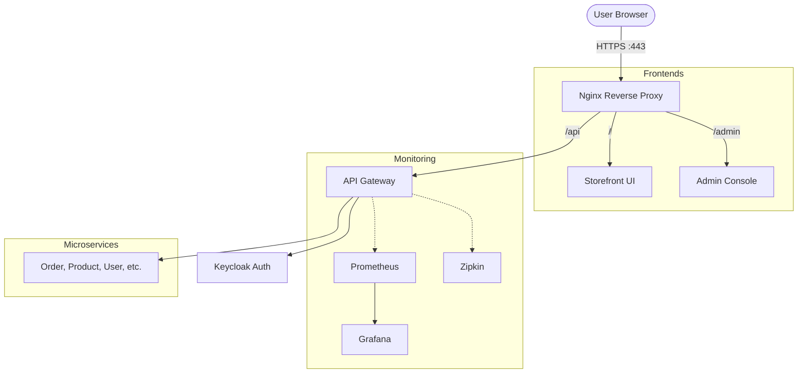

# GT Store: Phase 3 (Advanced Infrastructure & Admin) Walkthrough

Phase 3 transforms the GT Store from a functional microservices collection into a production-ready platform with professional routing, security, and deep observability.

## 1. Production-Grade Edge Infrastructure
The system now uses **Nginx** as its primary entrance, providing a single point of contact for the entire ecosystem.

- **SSL Termination**: All traffic is served over `https://localhost` using self-signed certificates.
- **Intelligent Routing**: 
    - `/` -> Main Storefront (React)
    - `/admin/` -> Admin Management Console (React)
    - `/api/` -> API Gateway (Spring Cloud)
- **High Availability DNS**: Configured with a Docker-aware resolver to prevent Nginx from crashing if backend services (like the Gateway) are still booting.

## 2. Admin Console & Access Control (RBAC)
Security has been hardened using Role-Based Access Control to separate shoppers from administrators.

- **Admin UI**: A dedicated Vite + React dashboard hosted at `/admin` for inventory and order management.
- **Keycloak RBAC**:
    - Users are assigned roles (`user`, `admin`) in Keycloak.
    - The API Gateway uses a custom `KeycloakRoleConverter` to extract these roles from JWT tokens.
- **Endpoint Protection**:
    - **Public**: `GET /api/products/**` (Catalog viewing).
    - **Admin Only**: `POST/PUT/DELETE` on Products/Categories and Global Order management.
    - **Authenticated**: Standard account actions (Orders, Profile).

## 3. Observability & Monitoring
A full-stack monitoring suite is integrated to track system health and request lifecycles.

- **Metrics (Prometheus & Grafana)**:
    - Every microservice exports metrics via Micrometer.
    - Prometheus scrapes these metrics.
    - Grafana (:3001) provides visual dashboards for CPU, memory, and request rates.
- **Distributed Tracing (Zipkin)**:
    - Tracks requests as they hop across microservices (e.g., Checkout -> Order -> Inventory).
    - Essential for debugging latency and failures in an event-driven system.

### Observability Ports
| Service | URL | Purpose |
| :--- | :--- | :--- |
| **Grafana** | [http://localhost:3001](http://localhost:3001) | Dashboarding (User: `admin` / `admin`) |
| **Prometheus** | [http://localhost:9090](http://localhost:9090) | Metrics Querying |
| **Zipkin** | [http://localhost:9411](http://localhost:9411) | Distributed Tracing |

## 4. System Architecture (Current)

## Next Steps: Search & Recommendations
The final piece of the Phase 3 roadmap is the integration of an **Elasticsearch/OpenSearch** engine to provide:
- Full-text search with fuzzy matching.
- Real-time product indexing via Kafka listeners.
- "People also viewed" recommendation logic.
