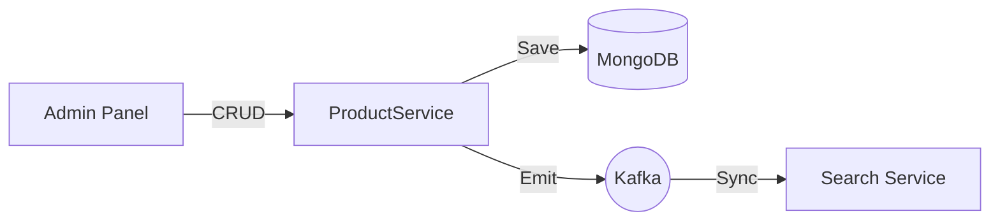

# Product Service

The **Product Service** manages the core catalog of the GT Store platform. It handles the inventory metadata, categories, brands, and promotional banners using a flexible document-based storage model.

## 🛠️ Technical Design

- **Framework**: Spring Boot 3 with Spring Data MongoDB.
- **Persistence**: **MongoDB** (Schemaless storage for complex product variants and attributes).
- **Messaging**: Kafka Producer for triggering search re-indexing.
- **Security**: RBAC (Admin only) for mutation endpoints; public access for catalog browsing.

## ⚙️ Configurational Design

### Features
- **Document Model**: Products are stored as flexible documents to accommodate varied attributes (Size, Color, Tech Specs).
- **Embedded Lists**: Caters to variants and images directly within the product document.

### Environment Variables
| Variable | Description | Default |
| :--- | :--- | :--- |
| `SERVER_PORT` | Service port | `4005` |
| `SPRING_DATA_MONGODB_URI` | MongoDB connection string | `mongodb://admin:password...` |

## 🔄 Interaction Flow

## ✨ Key Features

- **Rich Catalog**: Supports complex product hierarchies (Category > Brand > Product > Variant).
- **Banner System**: Manages promotional banners displayed on the storefront home page.
- **Elastic Sync**: Automatically notifies the Search service when products are added or updated to keep indexing fresh.

## 📖 Use Cases

- **Product Discovery**: Serves the detailed product pages and category listings to customers.
- **Marketing**: Allows admins to manage seasonal banners and featured collections.
- **Catalog Management**: Central hub for adding new SKUs and managing brand data.
