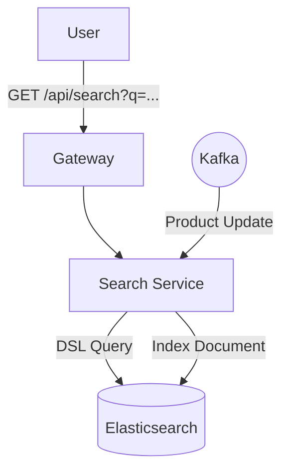

# Search Service

The **Search Service** provides high-performance, full-text search capabilities for the GT Store catalog. It specializes in complex queries, filters, and fast retrieval using a dedicated search index.

## 🛠️ Technical Design

- **Framework**: Spring Boot 3 with Spring Data Elasticsearch.
- **Persistence**: **Elasticsearch** (Inverted index for near-instant full-text search).
- **Messaging**: Kafka Consumer for listening to product updates.
- **Search Logic**: Supports fuzzy matching, category filtering, and keyword highlighting.

## ⚙️ Configurational Design

### Indexing Flow
This service maintains a read-optimized copy of the product catalog.
1. `product-service` performs a database update.
2. `product-service` emits an event on Kafka.
3. `search-service` consumes the event and updates the Elasticsearch index.

### Environment Variables
| Variable | Description | Default |
| :--- | :--- | :--- |
| `SERVER_PORT` | Service port | `4011` |
| `SPRING_ELASTICSEARCH_URIS` | Elasticsearch cluster URL | `http://elasticsearch:9200` |
| `SPRING_KAFKA_BOOTSTRAP_SERVERS` | Kafka broker address | `kafka:29092` |

## 🔄 Interaction Flow

## ✨ Key Features

- **Full-Text Search**: Search across names, descriptions, and category metadata.
- **Aggregations**: (Future) Capability to provide dynamic filters for categories, brands, and price ranges.
- **Near Real-Time Indexing**: Product changes appear in search results within seconds.

## 📖 Use Cases

- **Global Search**: Powering the search bar in the storefront navigation.
- **Fast Filtering**: Searching for products within a specific category or price point.
- **Fuzzy Matching**: Helping users find products even with slight typos.
