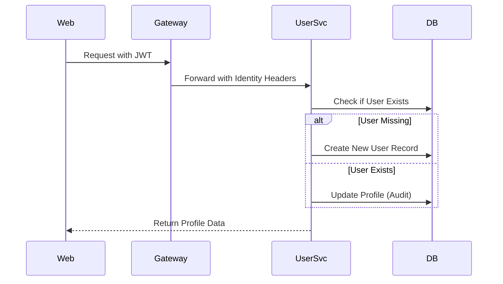

# User Service

The **User Service** manages customer profiles, shipping addresses, and administrative accounts. it works in tandem with the Identity Provider (Pahchaan/Keycloak) to ensure a seamless and secure user experience.

## 🛠️ Technical Design

- **Framework**: Spring Boot 3 with Spring Data JPA.
- **Persistence**: **PostgreSQL** (Storage for user attributes, addresses, and account metadata).
- **Identity Sync**: Just-In-Time (JIT) synchronization from Keycloak JWT claims.
- **Security**: RBAC integrated with Keycloak roles (`GTS_USER`, `GTS_ADMIN`).

## ⚙️ Configurational Design

### JIT Sync Logic
The service intercepts incoming requests through the gateway:
1. Extract user email and name from `X-User-Email` and `X-User-Name` headers.
2. If the user does not exist in the local database, it is created automatically.
3. If the user exists, its profile info (name) is updated if necessary.

### Environment Variables
| Variable | Description | Default |
| :--- | :--- | :--- |
| `SERVER_PORT` | Service port | `4004` |
| `SPRING_DATASOURCE_URL` | PostgreSQL connection string | `jdbc:postgresql://postgres...` |

## 🔄 Interaction Flow

## ✨ Key Features

- **Profile Management**: Store and retrieve user-specific information (Gender, Birthday, Secondary Phone).
- **Address Book**: Manages multiple shipping addresses per user for a faster checkout.
- **Role Awareness**: Synchronizes administrative roles to provide access to the Admin Web.
- **Transparent Creation**: No "Signup" process required in the microservice; it trusts the Identity Provider.

## 📖 Use Cases

- **Account Setup**: Capturing user details after their first login.
- **Checkout Efficiency**: Providing the default shipping address to the `order-service`.
- **Identity Integrity**: Ensuring that user data is consistent across the ecosystem.
